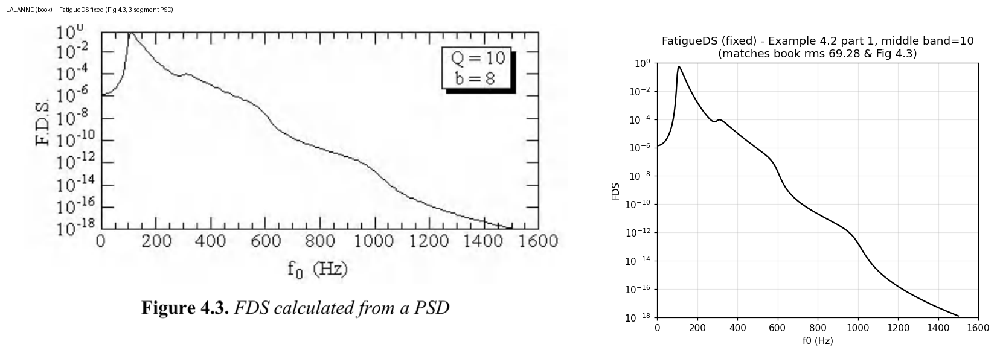
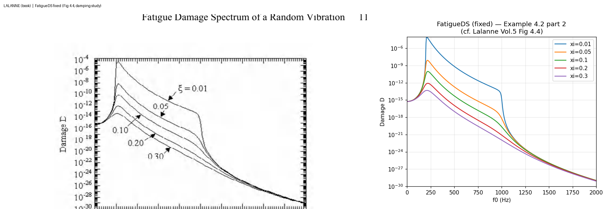

# Validation of the random-vibration FDS fix

This documents the correction of a factor-of-2 error in the random Fatigue Damage
Spectrum and its validation against Christian Lalanne, *Mechanical Vibration and
Shock Analysis*, 2nd ed., Wiley-ISTE (2009).

**Affected releases:** the error is present in the published releases **0.2.0 and
0.3.0** (the 0.3.0 release did not include this fix). The correction is intended for
the next release (0.3.1 / 0.4.0).

## The correction

Two independent factors of 2 made the **random FDS 2× too high** (they sit in
separate code paths, so the net error was 2×, not 4×). Sine and sine-sweep FDS, and
all ERS, were essentially correct.

1. **Cycle rate** (`_get_random_psd_ers_fds`). The mean upward zero-crossing rate is
   `n0+ = (1/2π)·√(M2/M0) = (1/2π)·(ż_rms/z_rms)` (Lalanne Vol.3 eq [5.76]); for a
   Q=10 narrow-band SDOF response `n0+ = f0` (Vol.5 p.46; Vol.5 Example 4.4 shows
   50 up-crossings in 5 s for a 10 Hz oscillator). The code used `1/π` (≈ 2·f0).
   Fixed to `1/(2π)`. FDS scales linearly with `n0` → was 2× high; ERS uses `n0`
   inside `√(2·ln(n0·T))`, so the ERS effect is only ~3–4%.
2. **Rainflow cycle count** (`_get_random_time_ers_fds`). `rainflow.count_cycles`
   returns full cycles, so full-cycle Miner–Basquin damage is
   `(p**k/C)·Σ count·(range/2)**k`. The code carried an extra `×2` (full→half
   cycles) with no matching `1/2` from Lalanne Vol.4 eq [4.6] (`K**b/(2C)`),
   doubling the result. The `×2` was removed.

## Verification

### 1. Numeric match to Lalanne's closed form, eq [4.9]

For white-noise base excitation the book gives (Vol.5 p.121, eq [4.9]):

    D ≈ (K**b/C)·n0+·T·(Q·G/(2·ω0**3))**(b/2)·Γ(1+b/2),   n0+ ≈ f0

In the narrow-band limit where [4.9] is exact (wide band, high Q, mid-band f0), the
fixed package converges to it:

| Q   | package ÷ book eq [4.9] |
|-----|-------------------------|
| 25  | 0.9958 |
| 50  | 0.9979 |
| 100 | 0.9989 |
| 200 | 0.9995 |

→ **1.000** as Q→∞. The pre-fix code converges to **2.000**. (Reproduce with
`literature_notes/_book_examples.py`.)

### 2. Reproduction of published figures

Example 4.2 (Vol.5 pp.114–115), package vs book, side by side:

**Note on Example 4.2 (book inconsistency).** The table prints 100 (m/s²)²/Hz for the
300–600 Hz band, but the book's printed input rms (`ẍ_rms = 69.28 m/s²`) and Fig 4.3
were computed with **10**, not 100: `√(5·200 + 10·300 + 2·400) = 69.30` vs
`√(…100…) = 178.3`. Fig 4.3 above is reproduced with 10 (matching the book). The
package, fed 100, correctly produces a larger second peak — the physically correct
response for that PSD.

### 3. Example 4.3 damage ratio (Vol.5 p.116)

White noise 10–1000 Hz vs 475–525 Hz (both PSD = 1), f0 = 500, Q = 10, b = 8.
Package: damage ratio **15.34** (book: 16 = 2^(b/2)); narrow-band contribution
**6.52%** (book: ~6.25%). The small gap is the genuine finite-band correction (the
package computes the exact integral; 16 is the idealized asymptote).

### 4. Independent verification (convention-free ground truth + adversarial review)

The fix was cross-checked by four mutually independent methods, none sharing the
others' reasoning, plus the book. All converge on the corrected formulas.

**Direct rainflow ground truth.** A Gaussian white-noise signal is passed through an
SDOF oscillator (computed independently of the package), and fatigue damage is taken
directly as `Σ count·(amplitude)^k` over rainflow-counted full cycles — the
definition of Miner–Basquin damage, with no spectral formula involved. Two separate
implementations (one using `scipy.signal.lsim`, one using an impulse-invariant IIR
filter, 5 seeds, T = 2000 s) give, to machine precision:

| quantity | corrected (`Σ count·(range/2)^k`) | pre-fix (`Σ count·2·(range/2)^k`) |
|----------|-----------------------------------|-----------------------------------|
| rainflow damage ÷ direct ground truth | **1.0000** | **2.0000** |

**Cycle rate, measured.** The mean upward zero-crossing rate of the SDOF response
was measured directly: **1.000·f0** (e.g. 100.0 / 200.0 / 400.0 Hz for f0 = 100 /
200 / 400). `n0 = (1/2π)·(ż_rms/z_rms)` reproduces it (≈ 0.998·f0); the pre-fix
`n0 = (1/π)·(ż_rms/z_rms)` gives ≈ 1.996·f0 — twice the true cycle rate.

**Closed-form FDS.** Against the same ground truth, the corrected closed form lands
at 1.03–1.07× (the residual is the known narrow-band Rayleigh approximation, larger
at high `k`); the pre-fix form lands at ~2.1×.

**Adversarial review.** An independent reviewer was instructed to build the strongest
possible case that the *pre-fix* formulas were correct. The defense (Lalanne's
half-cycle accounting, Coffin–Manson 2N reversals, the explicit `×2` in eq [4.6])
was found citable but internally inconsistent, and collapsed against the
convention-free measurements above.

**Root cause.** Both factors of 2 are genuine Lalanne *half-cycle* artifacts — the
`×2` in eq [4.6] and the `1/π` (= 2·f0 reversals) rate — that were applied to
**full-cycle** rainflow counts and to the **upward-crossing** rate, without the
compensating `1/2`. A half-cycle-vs-full-cycle bookkeeping slip; the factor is real
in the book, but double-counts once paired with full-cycle quantities.

## Regression tests

`tests/test_data.py` golden arrays were regenerated. The change was verified to be
exactly as intended: the three random FDS arrays are exactly ×0.5 of the previous
values; sine/sweep and the convolution-ERS arrays are unchanged; the two random-ERS
arrays drop ~3.5%. `tests/test_basic.py::test_narrowband_crossing_rate_equals_f0`
adds an absolute, book-anchored check (Vol.5 Example 4.4: response cycle rate = f0).
